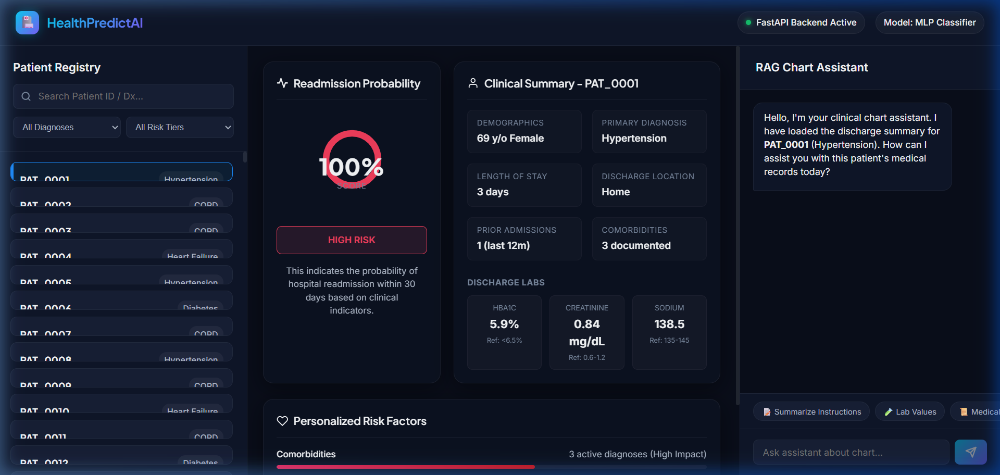

# HealthPredictAI 🏥

[](https://fastapi.tiangolo.com/)
[](https://reactjs.org/)
[](https://scikit-learn.org/)
[](https://xgboost.readthedocs.io/)
[](https://vitejs.dev/)

An **end-to-end full-stack AI/ML health-tech application** that predicts 30-day hospital readmission risk. It features a deep learning model pipeline, local explainable AI (XAI) feature importance tracking, and a Retrieval-Augmented Generation (RAG) assistant for querying clinical charts.

---

## 📸 Dashboard Interface



---

## ⚡ Why This Project Catches Recruiter Attention

This project showcases a complete **production-ready AI integration lifecycle**, demonstrating proficiency in:
* **Rigorous ML Model Selection**: Not just training a single model, but comparing multiple architectures (Neural Networks, Gradient Boosting, Random Forests) through 5-Fold Stratified Cross-Validation.
* **Explainable AI (XAI) in Action**: Resolving the neural network "black-box" issue by using an auxiliary tree-based classifier (XGBoost) to deliver patient-specific feature importances.
* **Semantic RAG Search**: Developing a custom vector database parsing unstructured clinical summaries and integrating LLMs (Gemini API) alongside an offline local fallback QA engine.
* **Full-Stack Orchestration**: Designing a fast asynchronous backend (FastAPI) linked to a custom glassmorphic SPA dashboard (Vite + React) using an API proxy.

---

## 📊 ML Model Selection & Performance Summary

We evaluated three classifier pipelines using **5-Fold Stratified Cross-Validation**. The **Multi-Layer Perceptron (MLP) Neural Network** outperformed other models and was selected for production deployment:

| Model Architecture | Avg Accuracy | Avg ROC-AUC | Avg F1-Score | Status |
| :--- | :---: | :---: | :---: | :---: |
| **MLP (Neural Network)** | **92.70%** | **0.9733** | **0.9323** | **🚀 Production Selected** |
| **XGBoost Classifier** | 90.10% | 0.9608 | 0.9085 | Auxiliary explainability |
| **Random Forest Classifier** | 85.70% | 0.9489 | 0.8712 | Baseline |

### Global Feature Importances (Calculated via Auxiliary XGBoost)
1. **Prior Admissions** (21.08% impact)
2. **Comorbidities** (14.09% impact)
3. **Length of Stay** (9.60% impact)
4. **Age** (8.85% impact)
5. **Discharged to Skilled Nursing Facility** (7.07% impact)

---

## 🛠️ Tech Stack & Architecture

* **Backend**: FastAPI, Uvicorn, Scikit-Learn, XGBoost, Pandas, NumPy, Pydantic
* **Frontend**: React (Vite), CSS Custom Properties (HSL colors, dark mode, glassmorphism)
* **Generative AI / RAG**: Gemini API (`text-embedding-004` & `gemini-1.5-flash`), custom Scikit-Learn TF-IDF vector database fallback.

```text
┌────────────────────────┐      REST API      ┌────────────────────────┐
│     Vite + React       │ ────────────────>  │        FastAPI         │
│   (Port 5173 Dev)      │ <────────────────  │     (Port 8000 Dev)    │
└────────────────────────┘                    └───────────┬────────────┘
            │                                             │
            ▼                                             ▼
┌────────────────────────┐                    ┌────────────────────────┐
│   Glassmorphic SPA     │                    │  - MLP Classifier (ML) │
│ - Interactive Registry │                    │  - XGBoost (XAI)       │
│ - Probability Gauge    │                    │  - Vector DB (RAG)     │
│ - Assistant Chat       │                    └────────────────────────┘
└────────────────────────┘
```

---

## 🚀 Getting Started

### 1. Backend Service Setup
Navigate to the backend folder, activate your virtual environment, and install requirements:
```bash
cd backend
# Windows
.\venv\Scripts\activate
# Install Packages
pip install -r requirements.txt
```

Generate patient records & summaries:
```bash
python generate_data.py
```

Train and pick the best ML model:
```bash
python train_model.py
```

Build the custom vector store:
```bash
python rag_pipeline.py
```

Run the API:
```bash
python main.py
```
*API is live at `http://127.0.0.1:8000`.*

### 2. Frontend Dashboard Setup
Navigate to the frontend folder, install npm packages, and run:
```bash
cd frontend
npm install
npm run dev
```
*Vite dev server is live at `http://localhost:5173/`.*

---

## 📡 API Endpoints

* **`GET /api/patients`**: Returns clinical summaries for the registry list.
* **`GET /api/patients/{id}/risk`**: Runs model inference and extracts ranked explainable risk factors.
* **`POST /api/patients/{id}/chat`**: Interfaces user questions with the RAG patient assistant.

---

## ⚠️ Disclaimer
This application is a clinical simulation utilizing synthetic patient profiles. It is built strictly for portfolio purposes and should not be used in live diagnostic environments.
